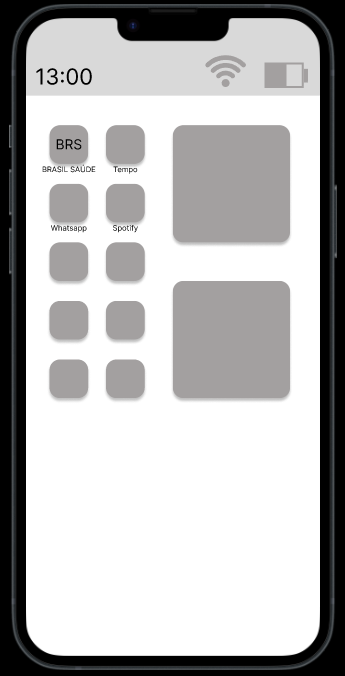

# 💻 Projeto: Protótipo de Aplicativo de Plano de Saúde

O objetivo deste projeto foi organizar as múltiplas funcionalidades de um App de Plano de Saúde, garantindo que a tarefa crítica de agendamento psicológico fosse rápida e acolhedora.

## 👤 Perfil do Usuário
Persona: *Adulto, rotina ocupada. *
Estado Emocional: *Vulnerável e com baixa tolerância a processos complexos ou burocráticos (fricção). *
Necessidade: *Encontrar um psicólogo disponível e agendar com o mínimo de cliques possível. *

## 🛠️ Soluções de Design Aplicadas
Para atender aos requisitos de baixa fricção, o wireframe focou em:

Acesso Direto: *Atalho em destaque para "Psicólogo de Plantão" logo na tela inicial. *
Filtros Inteligentes: *Busca simplificada por disponibilidade (data/hora) e especialidade. *
Fluxo Acolhedor: *Redução de campos de formulário desnecessários para evitar a sobrecarga do usuário. *
Confirmação Imediata: *Feedback claro de sucesso no agendamento para reduzir a ansiedade. *

  
  
✨ Clique na imagem acima para acessar o protótipo interativo no Figma 

